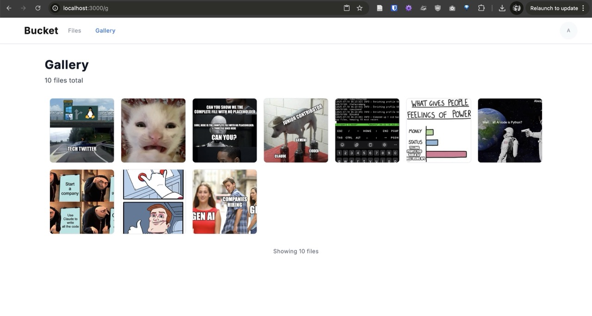

# 🪣 Bucket

### A beautifully simple file sharing platform built with Next.js

Share files effortlessly with drag-and-drop uploads, instant previews, and clean shareable links. Perfect for personal use or small teams.

[](https://nextjs.org/)
[](https://www.typescriptlang.org/)
[](https://tailwindcss.com/)
[](https://pnpm.io/)
[](https://opensource.org/licenses/MIT)
[](https://vercel.com/)

## 📸 Screenshot



## ✨ Why Bucket?

- **🎯 Simple & Clean** - No clutter, just upload and share
- **📱 Mobile First** - Works perfectly on any device
- **🚀 Lightning Fast** - Built with Next.js 14 and optimized for speed
- **🔒 Secure** - GitHub OAuth + admin credentials for access control
- **📦 No Vendor Lock-in** - Your files, your control
- **🎨 Beautiful Previews** - Images, videos, PDFs, and more

## 🚀 Quick Start

```bash
# Clone and install
git clone https://github.com/nibzard/bucket.git
cd bucket
pnpm install

# Setup environment
cp .env.example .env.local
# Edit .env.local with your values

# Setup database
pnpm db:generate && pnpm db:push

# Start developing
pnpm dev
```

Visit [localhost:3000](http://localhost:3000) and start uploading!

## 🎯 Features

### 📤 **Upload & Share**
- Drag-and-drop file upload with real-time progress
- Generate short, clean URLs for sharing (`/i/abc123`)
- Support for images, videos, audio, PDFs, and more
- Direct file access or beautiful preview pages

### 🔐 **Smart Authentication**
- GitHub OAuth for seamless login
- Admin credentials for private instances
- Public file viewing (no login required)
- Secure file management for authenticated users

### 📱 **Mobile-First Design**
- Responsive design that works on any device
- Touch-friendly swipe gestures
- Optimized for mobile uploads and viewing
- Clean, minimal interface

### ⚡ **Performance & UX**
- Lightning-fast uploads with UploadThing
- Pagination for large collections (20 files per page)
- Real-time feedback and loading states
- Optimistic updates for instant feel

### 🛠️ **File Management**
- Individual file deletion with confirmation
- Bulk operations with checkboxes
- "Select all" for quick management
- Complete cleanup with "delete all" option

<details>
<summary>🔧 <strong>Tech Stack</strong></summary>

- **Framework**: Next.js 14 with App Router
- **Database**: Drizzle ORM with Turso/LibSQL
- **Auth**: NextAuth.js (GitHub + credentials)
- **Storage**: UploadThing CDN
- **Styling**: Tailwind CSS
- **Language**: TypeScript
- **Package Manager**: pnpm

</details>

## 📋 Detailed Setup

<details>
<summary><strong>Step-by-step setup guide</strong></summary>

### 1. **Get the code**
```bash
git clone https://github.com/nibzard/bucket.git
cd bucket
pnpm install
```

### 2. **Set up UploadThing**
1. Go to [UploadThing](https://uploadthing.com/) and create an account
2. Create a new app and get your API token
3. Keep this token handy for the next step

### 3. **Configure environment variables**
```bash
cp .env.example .env.local
```
Open `.env.local` and fill in your values (see comments in the file for guidance)

### 4. **Set up your database**
```bash
pnpm db:generate  # Generate the database schema
pnpm db:push      # Apply it to your database
```

### 5. **Start developing**
```bash
pnpm dev
```

Your app will be available at [localhost:3000](http://localhost:3000)

</details>

## 🚀 Deploy to Vercel

[](https://vercel.com/new/clone?repository-url=https://github.com/nibzard/bucket)

<details>
<summary><strong>Manual deployment guide</strong></summary>

### Quick Deploy
1. Push your code to GitHub
2. Connect your repository to Vercel
3. Set your environment variables in Vercel dashboard
4. Deploy! 🎉

### Environment Variables for Production
Make sure to set these in your Vercel dashboard:
- `UPLOADTHING_TOKEN` - Your UploadThing API token
- `NEXTAUTH_URL` - Your domain (e.g., https://your-app.vercel.app)
- `NEXTAUTH_SECRET` - Generate with: `openssl rand -base64 32`
- `ADMIN_USERNAME` - Your admin username
- `ADMIN_PASSWORD` - Your admin password
- `TURSO_DATABASE_URL` - Your Turso database URL
- `TURSO_AUTH_TOKEN` - Your Turso auth token

</details>

## 🎯 How to Use

### 👀 **For Visitors**
- Visit the homepage to browse all uploaded files
- Click any file name to view it with a beautiful preview
- Use `/i/{slug}` URLs for direct file access (perfect for sharing)

### 🔐 **For Authenticated Users**
- **Login** at `/login` with GitHub or admin credentials
- **Upload** files by dragging them onto the homepage
- **Manage** files with delete options and bulk operations
- **Share** files using the generated short URLs

### 📱 **Mobile Experience**
- Swipe left/right to navigate between files
- Touch-friendly interface for easy uploads
- Responsive design that works on any screen size

## 📁 File Support

| Type | Max Size | Formats |
|------|----------|---------|
| **Images** | 16MB | JPEG, PNG, WebP, GIF, SVG |
| **Videos** | 256MB | MP4, WebM, MOV, AVI |
| **Audio** | 64MB | MP3, WAV, OGG, M4A |
| **Documents** | 32MB | PDF |
| **Text** | 4MB | TXT, MD, JSON, etc. |
| **Other** | 128MB | Any file type |

<details>
<summary>🔌 <strong>API Reference</strong></summary>

### File Operations
- `GET /api/files/[id]` - Get file metadata
- `DELETE /api/files/[id]` - Delete individual file (auth required)
- `POST /api/files/bulk-delete` - Delete multiple files (auth required)
- `POST /api/files/delete-all` - Delete all files (auth required)

### File Access
- `GET /i/[slug]` - Direct redirect to file content
- `GET /f/[slug]` - File preview page with metadata

### Upload
- `POST /api/uploadthing` - File upload endpoint (auth required)

</details>

## 🛠️ Development

<details>
<summary><strong>Available Scripts</strong></summary>

### Development
```bash
pnpm dev                    # Start development server
pnpm dev:debug             # Start with enhanced debugging
pnpm build                 # Build for production
pnpm start                 # Start production server
pnpm lint                  # Run linting
pnpm typecheck            # Type checking
```

### Database
```bash
pnpm db:generate           # Generate database schema
pnpm db:push              # Push schema to database
```

### Monitoring & Debugging
```bash
pnpm monitor              # Start server with basic monitoring
pnpm monitor:test         # Start server and run performance tests
pnpm monitor:full         # Full monitoring with resource tracking
pnpm logs:clean           # Clean up old log files
```

### Debug Mode
```bash
DEBUG_MODE=true pnpm dev  # Enable enhanced logging
```

</details>

<details>
<summary><strong>Project Structure</strong></summary>

```
bucket/
├── app/                    # Next.js App Router
│   ├── api/               # API routes
│   ├── f/[slug]/          # File preview pages
│   ├── i/[slug]/          # Direct file access
│   └── login/             # Authentication
├── components/            # React components
├── lib/                   # Utilities and config
│   ├── auth.ts           # Authentication setup
│   ├── db/               # Database schema
│   └── logger.ts         # Logging system
└── scripts/              # Development scripts
```

</details>

## 🤝 Contributing

We welcome contributions! Here's how you can help:

1. **🐛 Report Issues** - Found a bug? [Open an issue](https://github.com/nibzard/bucket/issues)
2. **💡 Suggest Features** - Have an idea? We'd love to hear it!
3. **🔧 Submit PRs** - Ready to contribute code? Fork and submit a pull request
4. **📚 Improve Docs** - Help make the documentation better

### Development Setup
```bash
git clone https://github.com/nibzard/bucket.git
cd bucket
pnpm install
cp .env.example .env.local
# Edit .env.local with your values
pnpm db:generate && pnpm db:push
pnpm dev
```

## 📝 License

This project is licensed under the MIT License - see the [LICENSE](LICENSE) file for details.

## 🙏 Acknowledgments

- [UploadThing](https://uploadthing.com/) for amazing file upload infrastructure
- [NextAuth.js](https://next-auth.js.org/) for seamless authentication
- [Vercel](https://vercel.com/) for the best deployment experience
- [Turso](https://turso.tech/) for edge database hosting

---

<div align="center">
  <strong>Built with ❤️ using Next.js</strong>
  <br><br>
  <a href="https://bucket-lake.vercel.app/">🌐 Live Demo</a> •
  <a href="https://github.com/nibzard/bucket/issues">🐛 Report Bug</a> •
  <a href="https://github.com/nibzard/bucket/pulls">🔧 Request Feature</a>
</div>